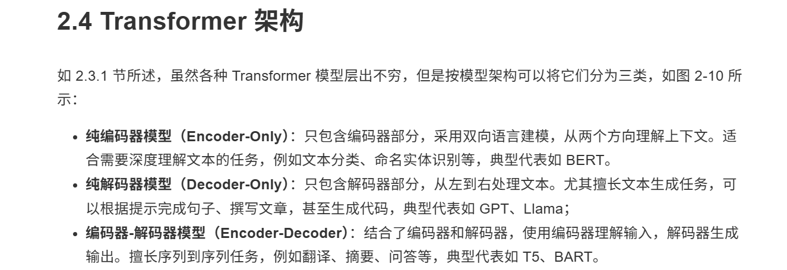
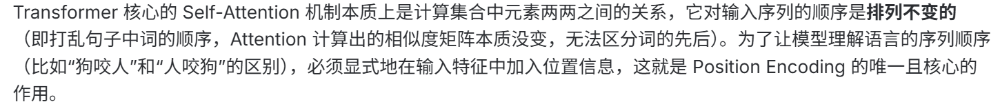
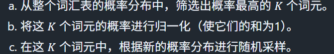
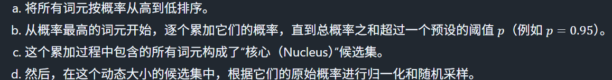
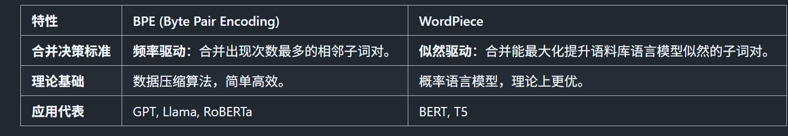
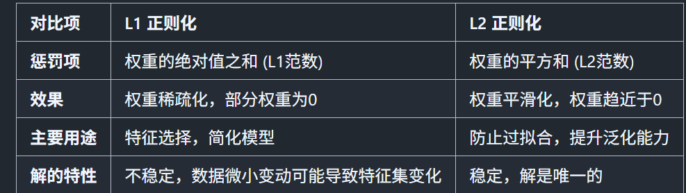
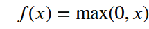
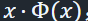
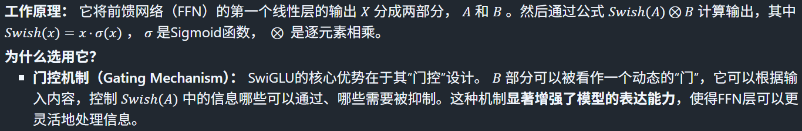

### transformer模型
encoder-->访问原始输入句子中所有词语
decoder-->迭代地基于已经生成的词来逐个预测后面的词

### transformer自注意力机制
1. 生成Q K V向量->注意力分数q k点积->缩放获得稳定梯度 除以根号下dk(k是下标)->softmax归一化变成综合为1->加权求和
2. 相较于RNN:并行计算+解决长度依赖

### 位置编码

一个与词嵌入维度相同的向量，向模型注入关于词元在输入序列中绝对或相对位置的信息。它会与词元的词嵌入（Token Embedding）相加，然后一同输入到Transformer的底层。

### 解码策略
Greedy Search-->选概率最词元作为输出
Beam Search(集束搜索)-->每次保留 k个最有可能的候选序列。在下一步，它会从这 k个候选序列出发，生成所有可能的下一个词元，然后从所有这些扩展出的新序列中，再次选出累计概率最高的 k个。最后，从最终的 k个完整序列中选择最优的一个。
Top-k

Top-p

### 词元化
将原始文本分解成一个个独立的单元（词元||token）并将独立单元映射到唯一的整数id

### L1和L2正则化-->防止过拟合：过拟合：是指模型在训练集上表现很好，但在未见过的测试集上表现很差，原因是模型过度学习了训练数据中的噪声和细节。
L1->绝对值之和乘以lambda
L2->平方值之和乘以lambda

### 涌现能力
当模型规模（包括参数量、训练数据和计算量）达到某个临界点后，突然出现并显著超越随机水平的能力。-->思维链 上下文学习 执行复杂指令...

### 激活函数
1. ReLU-->负值变为0  
2. GeLU--> 平滑 随机正则化
3. SWiGLu

