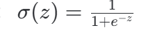
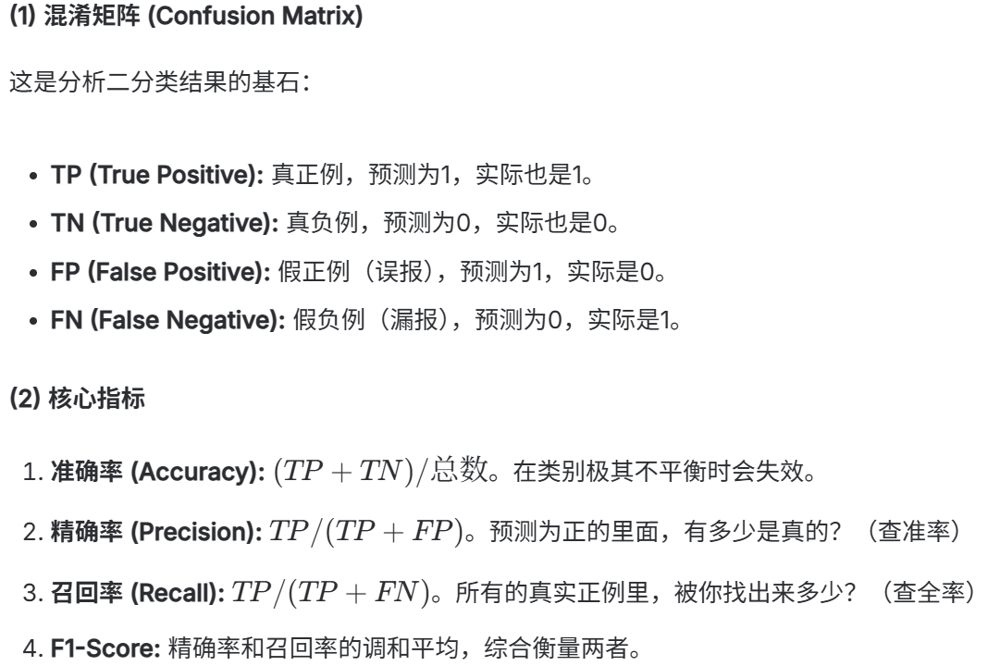

### 分类
y属于一个离散型集合 找出y所归属的类别

根据输入 找出其所属于每一个类别的概率 如何从概率值里找出最大值

torchvision-->mnist数据集
torchvision-->cifar 数据集 

分类-->y为通过考试的概率
回归-->算出具体值

### sigmod函数
通过一个函数 把实数的值映射到0~1-->sigmod

### 二分类损失函数
交叉熵:-->表示两个分布间差异大小
loss = -(ylog(y_pre)+(1-y)log(1-y_pre))-->BCE Loss y是真实标签0|1 y_pre是预测概率

### 决策门槛
模型输出的是概率（如 0.7），我们需要将其转为类别（0 或 1）。
y>0.5所属类别为1 y<0.5所属类别为0

### 二分类评估标准

