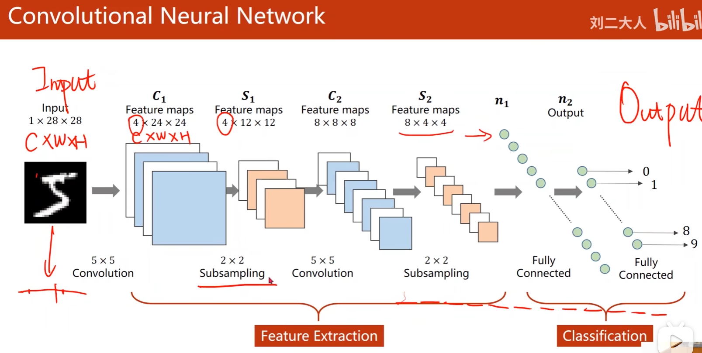
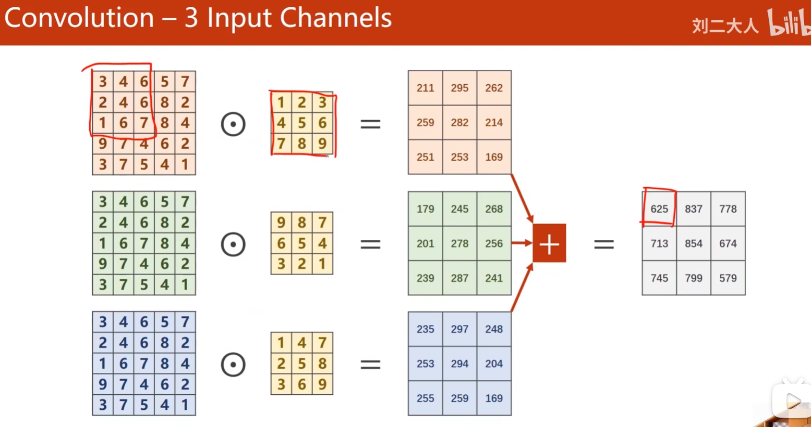

### CNN-->Convolutional Neural Network

### 图像（channel） RGB

**通道（Channel）** 是构成图像的颜色分量：
- **1 通道**：灰度图（黑白图）
- **3 通道**：RGB 彩色图（红、绿、蓝三层）
- **4 通道**：RGBA（RGB + 透明度）

**RGB 色彩模式**：
- **R（Red）** - 红色通道
- **G（Green）** - 绿色通道
- **B（Blue）** - 蓝色通道

每个像素由这三个通道的值（0-255）组成，通过组合产生各种颜色。
例如：(255,0,0)=红色，(255,255,255)=白色

### 卷积过程

卷积是 CNN 的核心操作，通过**卷积核**（滤波器）在输入图像上滑动，提取特征。

eg:3 channel-->1 channel

**过程说明**：
- 输入：3 通道的 RGB 图像
- 卷积核在图像上滑动，进行逐元素乘积和求和
- 输出：1 个特征图（单通道的卷积结果）
- 多个卷积核可以产生多个特征图

### 术语

**padding-->填充圈数（默认填充0）**
- 作用：在图像周围填充 0
- 目的：
  - 保持输出大小与输入相同
  - 防止边界信息丢失
- 例如：5×5 图像用 padding=1 后变成 7×7

**stride-->步长**
- 作用：卷积核在图像上滑动的距离
- stride=1：每次移动 1 个像素（输出更大，更详细）
- stride=2：每次移动 2 个像素（输出更小，下采样）
- 公式：输出大小 = (输入大小 - 卷积核大小 + 2×padding) / stride + 1

**MaxPooling-->最大池化**
- 操作：把输入按照 2×2 分成小矩阵，从每个矩阵里取出最大值，整合成新矩阵
- 作用：
  - 降低维度，减少计算量
  - 提取主要特征
  - 增加网络鲁棒性
- 例如：4×4 矩阵经过 MaxPooling 变成 2×2 矩阵