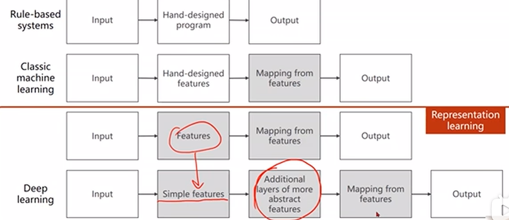

### 深度学习-->通过多层非线性变换，把输入映射到输出，自动提取有用特征，而无需人工设计特征。

深度:网络有很多层 每一层都可以提取到不同的特征

### SVM-->在特征空间中找到一个最优分割超平面（Hyperplane），将不同类别的数据尽可能分开。
1. 超平面：在二维是直线，在三维是平面，高维就是高维空间的平面。
2. 间隔（Margin）：离超平面最近的正负样本之间的距离。
3. 支持向量（Support Vectors）：离超平面最近的点，这些点决定了最终的分类边界。
SVM 的目标是 最大化间隔（最大化 Margin），这可以让模型更有泛化能力。

###  维度诅咒-->维度越高 所需要提取的特征数据越大