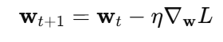
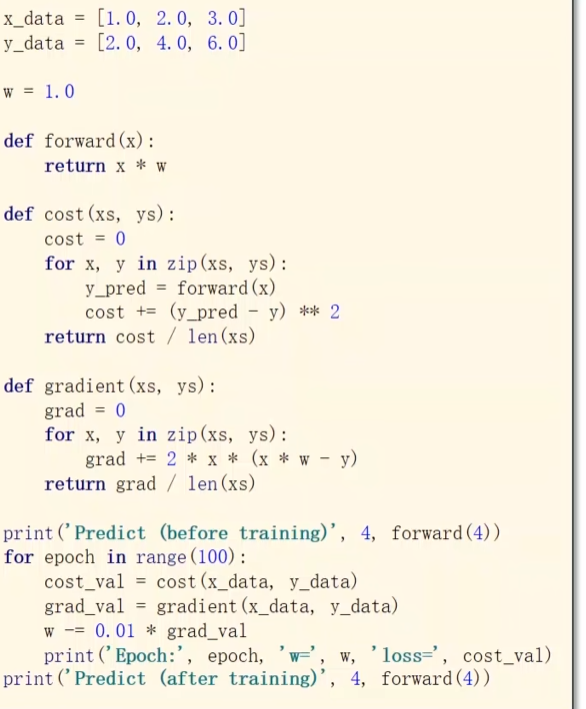

优化:寻找使得目标函数取得最小值或者最大值
### 梯度下降算法:-->性能低 时间复杂高

用全部数据算梯度 慢 稳定

当我们计算均方误差（MSE）时，损失函数 $L(w)$ 关于 $w$ 的图像通常是一个开口向上的抛物线（二次函数）。最低点：误差最小，对应的 $w$ 就是最优解。导数（梯度）：就是你在山上某一点时，脚下坡度的倾斜方向和程度。
**可能出现的问题**
鞍点
局部最优

### 随机梯度下降-->可以获得更优点 但无法并行 时间复杂度最高
处理鞍点问题 每次取出一个样本 求梯度然后进行更新

### 批量的随机梯度下降-->mini_batch
每次选一组数据进行随机梯度下降

