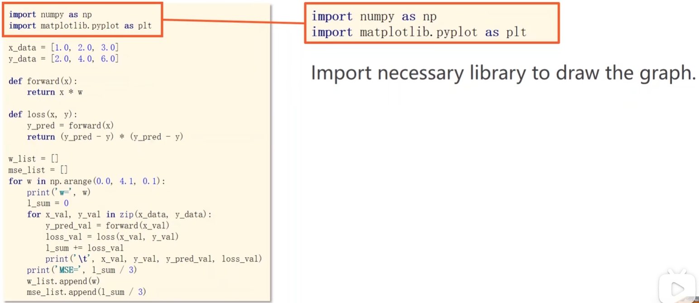

### 线性模型
随即预测一个权重w值 计算样本单个loss 然后取出平均损失 然后继续找出一个w值 使得平均损失最小-->即取出平均平方误差最小（MSE）Mean Square Error

穷举法：先找出w可能区间 再从区间里取出每一个可能值 进行计算找出使得mse最小的方差

### machine learning
dataset-->model-->training-->inferring

### 过拟合
本质:模型将训练样本中的随机误差（噪声）当成了普遍规律进行了学习。
训练集上误差很小 泛化能力差（泛化 对于没见过的东西模型拟合能力）

### 开发集
对于训练的数据 一部分用来训练 另一部分用来开发评估

### 模型设计
找到一个函数 可以很好的拟合数据
一般从简单的线性函数开始

### compute loss
模型预测的值减去真实值然后去平方