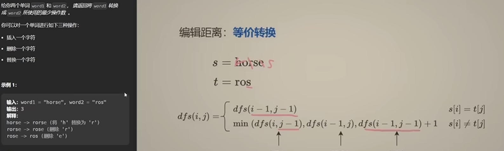

```
def dfs(i,j):
    if i<0:
        return j+1#要把剩余的都加上
    if j<0:
        return i+1#要把剩余的都减去
    if str1[i]==str2[j]:
        return dfs(i-1,j-1)
    return min(dfs(i-1,j-1),dfs(i,j-1),dfs(i-1,j))+1
```