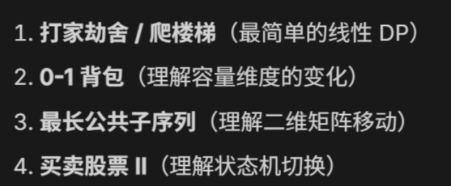

动态规划（Dynamic Programming, DP）是算法面试中的“大山”。它的核心思想是：**将一个复杂问题分解成若干个重叠的子问题，通过存储子问题的解（通常用数组）来避免重复计算，从而提高效率。**

理解 DP 有个“三部曲”：

1. **定义状态**：`dp[i]` 或 `dp[i][j]` 到底代表什么？
2. **状态转移方程**：怎么从已知的子状态推出当前状态？（这是最难的一步）
3. **初始化和边界**：最开始的几种简单情况是什么？

**DP类型**
---

如果说**回溯算法**是在进行“尝试与回头”的**穷举**，那么**动态规划（DP）**就是带有“记忆”的**递推**。

我们可以根据**问题的结构（状态定义的维度）**，将动态规划总结为以下几大核心模型：

---

### 1. 线性 DP (Linear DP)
**特征：** 状态沿着数组或序列的下标线性增长。通常是一维或多维数组。
*   **经典代表**：最长递增子序列 (LIS)、爬楼梯、打家劫舍。
*   **状态定义**：`dp[i]` 表示以第 $i$ 个元素**结尾**或**达到**第 $i$ 个位置时的最优值。
*   **转移思路**：当前状态 $i$ 依赖于前面的某一个或多个状态（如 $i-1, i-2$ 或 $0 \dots i-1$ 中的最大值）。

### 2. 双序列/字符串 DP (Two-Sequence DP)
**特征：** 涉及两个字符串或数组。网格状的状态空间。
*   **经典代表**：最长公共子序列 (LCS)、编辑距离（动态距离）。
*   **状态定义**：`dp[i][j]` 表示第一个字符串的前 $i$ 个字符与第二个字符串的前 $j$ 个字符之间的某种关系。
*   **转移思路**：看 `s1[i]` 和 `s2[j]` 是否相等。
    *   相等：通常继承自 `dp[i-1][j-1]`。
    *   不等：在删除、插入、替换（即 `dp[i-1][j], dp[i][j-1], dp[i-1][j-1]`）中取最优。

### 3. 背包 DP (Backpack / Knapsack)
**特征：** 有一个“容量”限制，每个物品有“价值”和“体积”。
*   **经典代表**：0-1背包、完全背包。
*   **状态定义**：`dp[i][j]` 表示在前 $i$ 个物品中选择，且总体积**不超过** $j$ 时的最大价值。
*   **转移思路**：核心在于**选或不选**当前物品。
    *   `dp[i][j] = max(dp[i-1][j], dp[i-1][j - w[i]] + v[i])`
*   **优化**：通常可以利用“滚动数组”将二维空间优化为一维。

### 4. 区间 DP (Interval DP)
**特征：** 状态定义在一个区间 $[i, j]$ 上，大区间由小区间合并而成。
*   **经典代表**：最长回文子序列 (LPS)、多边形三角剖分、石子合并。
*   **状态定义**：`dp[i][j]` 表示下标从 $i$ 到 $j$ 这个闭区间内的最优解。
*   **转移思路**：枚举分割点 $k$，将 $[i, j]$ 拆分为 $[i, k]$ 和 $[k+1, j]$。
    *   `dp[i][j] = min/max(dp[i][k] + dp[k+1][j] + 合并成本)`

### 5. 状态机 DP (State Machine DP)
**特征：** 每一天或每一步有多个不同的“状态”，状态之间有明确的转化逻辑。
*   **经典代表**：买卖股票问题（持有、不持有、冷冻期）。
*   **状态定义**：`dp[i][state]` 表示第 $i$ 天处于 `state` 状态时的最大利润。
*   **转移思路**：根据当天的动作（买入、卖出、休息）进行转化。
    *   例如：今天“不持有” = `max(昨天就不持有, 昨天持有今天卖了)`。

---

### DP 核心要素总结表

| 类型 | 状态定义示例 | 转移方向 | 关键点 |
| :--- | :--- | :--- | :--- |
| **线性 DP** | `dp[i]` | $0 \dots i-1 \to i$ | 找之前的最优值来拼接当前 |
| **字符串 DP** | `dp[i][j]` | 左、上、左上 $\to$ 右下 | 字符匹配则 +1，不匹配则取最值 |
| **背包 DP** | `dp[j]` (容量) | 较小容量 $\to$ 较大容量 | **倒序**遍历是0-1背包，**正序**是完全背包 |
| **区间 DP** | `dp[i][j]` | 短区间 $\to$ 长区间 | 先枚举区间长度，再枚举起点 |
| **状态机 DP** | `dp[i][0/1]` | 昨天的各状态 $\to$ 今天 | 每一天都有多个并列的状态数组 |

---

### DP vs 回溯：到底什么时候用 DP？

1.  **重叠子问题**：如果你画出回溯的递归树，发现同一个函数参数被调用了成百上千次（比如斐波那契 `f(3)` 被算了很多次），说明需要 DP（或记忆化搜索）。
2.  **最优子结构**：大问题的最优解可以通过小问题的最优解推导出来。
3.  **只求数值，不求路径**：
    *   如果题目问：**“共有多少种解？”** 或 **“最大是多少？”** $\to$ 用 **DP**。
    *   如果题目问：**“请列出所有具体的解？”** $\to$ 用 **回溯**。

---

**经典题型**
---

### 1. 背包问题 (Knapsack Problem)
这是 DP 的入门基石，主要分为 **0-1 背包**和**完全背包**。
*   **问题**：你有一个容量为 $W$ 的背包，一堆物品有各自的重量和价值，怎么装价值最高？
*   **0-1 背包**：每件物品只能选一个（选或不选）。
    *   `dp[i][j]`：前 $i$ 个物品，在背包容量为 $j$ 时的最大价值。
    *   **转移方程**：`dp[i][j] = max(不选i, 选i)` 
        $\to$ `max(dp[i-1][j], dp[i-1][j - weight[i]] + value[i])`
*   **完全背包**：物品有无限个，可以重复选。
    *   **区别**：选了物品 $i$ 后，状态依然从第 $i$ 个物品转移，而不是 $i-1$。

### 2. 编辑距离 (Edit Distance / 动态距离)
*   **问题**：把字符串 A 变成 B，最少需要几次操作（插入、删除、替换一个字符）？
*   **状态**：`dp[i][j]` 表示 A 的前 $i$ 个字符变成 B 的前 $j$ 个字符所需最少步数。
*   **转移方程**：
    *   如果 `A[i] == B[j]`，则 `dp[i][j] = dp[i-1][j-1]`（不用动）。
    *   如果 `A[i] != B[j]`，则在三种操作里选最小的：`min(插入, 删除, 替换) + 1`。

### 3. 多边形三角形剖分的最低得分 (Interval DP)
这是**区间 DP** 的经典。
*   **问题**：一个 $n$ 边形，把它切成 $n-2$ 个三角形，每个三角形的分数是三个顶点数值的乘积，求总分最低是多少。
*   **状态**：`dp[i][j]` 表示从顶点 $i$ 到顶点 $j$ 构成的多边形进行剖分的最低得分。
*   **转移方程**：在 $i$ 和 $j$ 之间找一个顶点 $k$，把多边形分成两部分 + 一个三角形 $(i, j, k)$。
    *   `dp[i][j] = min(dp[i][k] + dp[k][j] + weight[i]*weight[j]*weight[k])`

### 4. 买卖股票问题 (State Machine DP)
这类题通常有多个版本（买一次、无限次、买两次、带手续费、带冷冻期）。
*   **核心状态**：每一天只有两种状态：**持有股票**或**不持有股票**。
    *   `dp[i][0]`：第 $i$ 天结束，手里**没有**股票的最大利润。
    *   `dp[i][1]`：第 $i$ 天结束，手里**持有**股票的最大利润。
*   **转移**：
    *   `dp[i][0] = max(昨天就没有, 昨天有今天卖了)`
    *   `dp[i][1] = max(昨天就有, 昨天没有今天买了)`

### 5. 最长递增子序列 (LIS - Longest Increasing Subsequence)
*   **问题**：数组 `[10, 9, 2, 5, 3, 7]` 中，最长的递增序列是 `[2, 5, 7]` 或 `[2, 3, 7]`，长度为 3。
*   **状态**：`dp[i]` 表示以第 $i$ 个元素**结尾**的最长递增子序列的长度。
*   **转移**：遍历 $i$ 之前所有的 $j$，如果 `nums[i] > nums[j]`，那么 $nums[i]$ 可以接到 $nums[j]$ 后面。
    *   `dp[i] = max(dp[j]) + 1`

### 6. 最长公共子序列 (LCS - Longest Common Subsequence)
*   **问题**：找两个字符串最长的共同“部分”（不一定连续）。如 `abcde` 和 `ace` 的 LCS 是 `ace`。
*   **状态**：`dp[i][j]` 表示 A 的前 $i$ 个字符和 B 的前 $j$ 个字符的 LCS 长度。
*   **转移**：
    *   如果 `A[i] == B[j]`，则 `dp[i][j] = dp[i-1][j-1] + 1`（在原来的基础上加1）。
    *   如果 `A[i] != B[j]`，则 `dp[i][j] = max(dp[i-1][j], dp[i][j-1])`（取两边最长的）。

### 7. 最长回文子序列 (LPS - Longest Palindromic Subsequence)
注意：子序列可以不连续，子串必须连续。
*   **问题**：字符串 `bbbab` 的最长回文子序列是 `bbbb`，长度为 4。
*   **状态**：`dp[i][j]` 表示字符串从 $i$ 到 $j$ 范围内的最长回文子序列长度。
*   **转移**：
    *   如果 `s[i] == s[j]`，那么首尾可以配对：`dp[i][j] = dp[i+1][j-1] + 2`。
    *   如果 `s[i] != s[j]`，那么缩减范围：`dp[i][j] = max(dp[i+1][j], dp[i][j-1])`。

---

### 总结：如何一眼识破 DP？

1.  **求最优解**（最大、最小、最长、最少步数）。
2.  **求方案数**（总共有多少种走法）。
3.  **子问题重叠**（比如爬楼梯，爬到 10 层取决于爬到 8 层和 9 层，这会有大量重复计算）。
4.  **无后效性**（当前决策只受之前状态影响，不受未来状态影响）。

**学习建议**：
*   先练 **LIS/LCS**，理解二维坐标系下的状态转移。
*   再练 **背包问题**，理解如何优化空间（把二维数组压缩成一维）。
*   最后攻克 **区间 DP** 和 **股票问题**。

你对这其中的哪一个具体问题最感兴趣？我可以给你写出具体的 Python 代码实现。