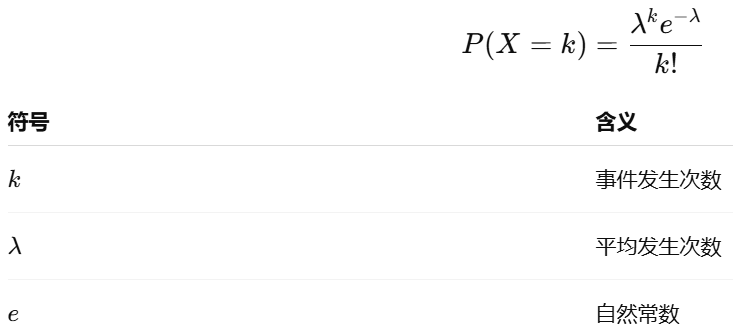
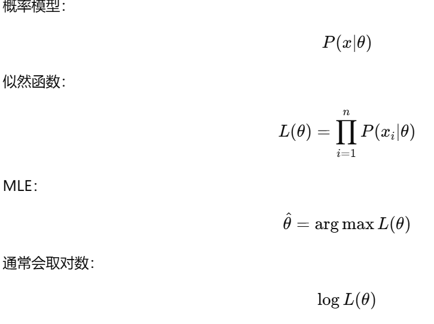
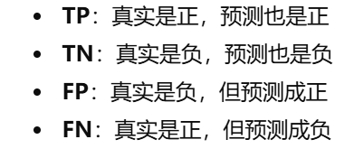
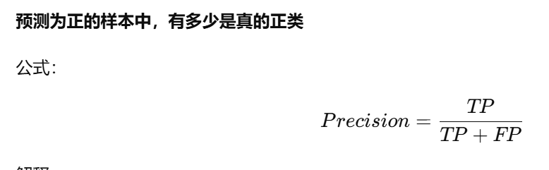
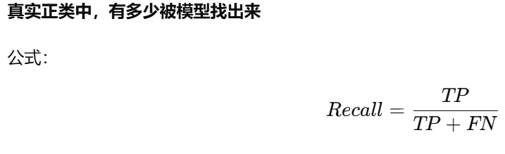
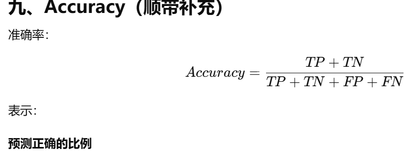
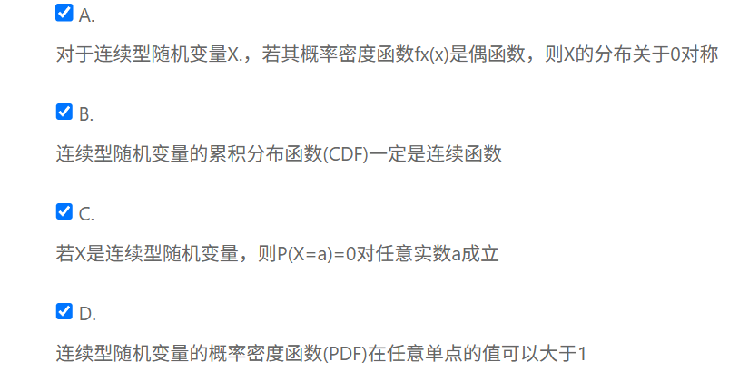

### 岭回归

### 泊松分布-->单位时间或单位空间内事件发生次数

### 极大似然函数-->选择一个参数，使得当前观测数据出现的概率最大

### TP TN FP FN

-->precision预测真的里面到底有多少真的
-->reacll真的里面有多少被判断出来
-->accuracy 预测正确的有多少 如果数据不平衡则没有意义

### 交叉熵损失函数

### 连续型随机变量
**如果随机变量X的取值可以在某个区间内取任意实数，则称为连续型随机变量**
