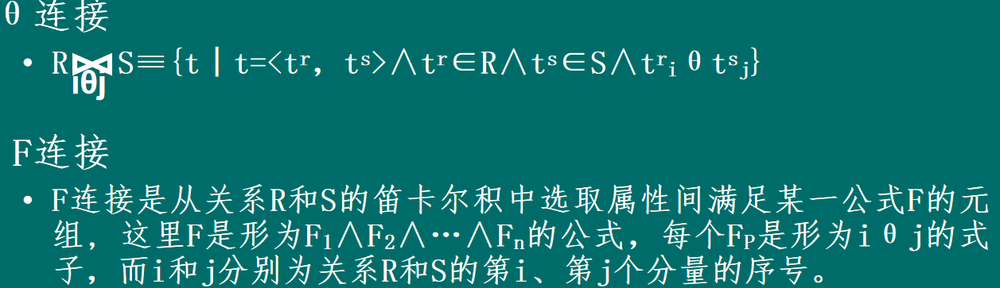
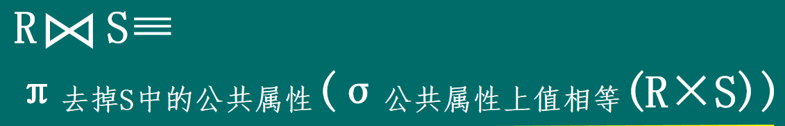
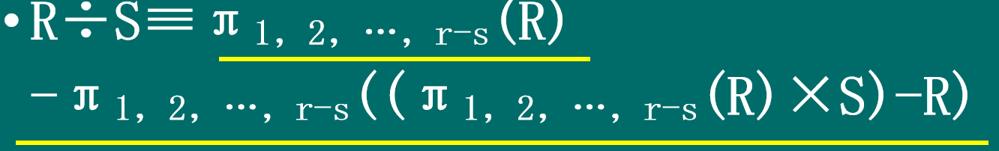

### 关系模型
定义:用二维表格表示实体集 用关键码进行数据导航（从已知数据查找未知数据）的数据模型称为关系模型

### 五个基本操作
1. 并 属于A或者属于B-->A并B
2. 差 属于R但不属于S-->R-S
3. 笛卡尔积 -->用 R 中的每一行，去连接 S 中的每一行

4. 操作,符号,分割方向,对应 SQL 关键字,作用
投影,π,垂直,SELECT,选出想要的列，改变表的“宽度”
选择,σ,水平,WHERE,选出符合条件的行，改变表的“高度”

### 四个组和操作
1. 交集
2. 连接

3. 自然连接-->先笛卡尔积 有相同公共部分的那一行保留 其余删除

4. 除法操作

