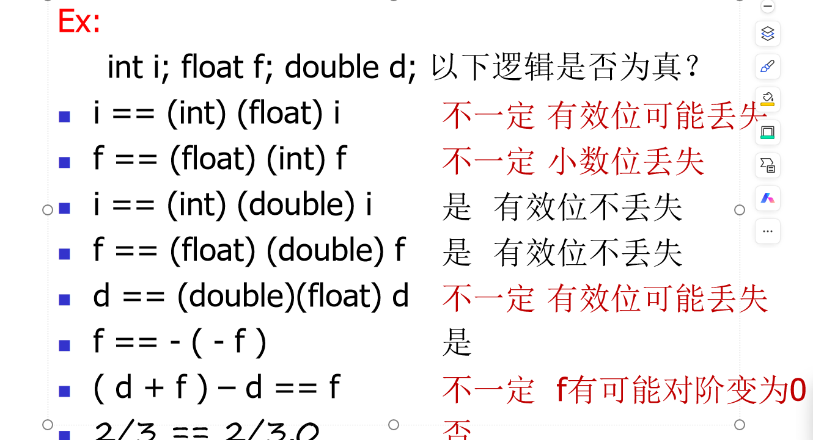

### 二进制编码
信息用0/1表示
真值-->机器数真正的值即现实中的正负号的数
机器数-->用0/1编码的计算机内部的0/1序列
浮点数：浮点数=符号×尾数×2指数
模:A ≡ B（mod M）-->A B模M同余--->一个负数的补码等于模加上这个数
**原码 0-->正数 1-->负数**
**正数的补码-->等于它本身 负数的补码-->原码按位取反加一**
**移码**-->将每一个数加上一个偏置常数-->bias=2^(n-1)-->在补码的基础上，将符号位取反

### 整数表示
无符号整数-->全部是正数运算且不会出现负数的情况下0-2^n - 1
有符号整数-->-2^n-1~2^n-1 - 1

### 数据的基本宽度
bit-->计算机中处理、存储、传输信息的最小单位
byte-->二进制信息的计量单位是“字节”
word-->表示被处理信息的单位，用来度量数据类型的宽度
字长-->”字长”等于CPU内部总线的宽度、运算器的位数、通用寄存器的宽度等

##数据存储

**大端法**:高字节优先
**小端法**:低字节优先