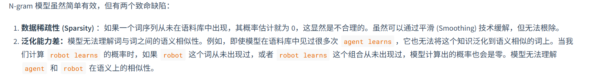

马尔可夫假设：我们不必回溯一个词的全部历史，可以近似地认为，一个词的出现概率只与它前面有限的n-1个词有

RNN-->循环神经网络

RNN 的设计引入了一个隐藏状态 (hidden state) 向量，我们可以将其理解为网络的短期记忆。在处理序列的每一步，网络都会读取当前的输入词，并结合它上一刻的记忆（即上一个时间步的隐藏状态），然后生成一个新的记忆（即当前时间步的隐藏状态）传递给下一刻

### Transformer架构解析-->注意力机制

