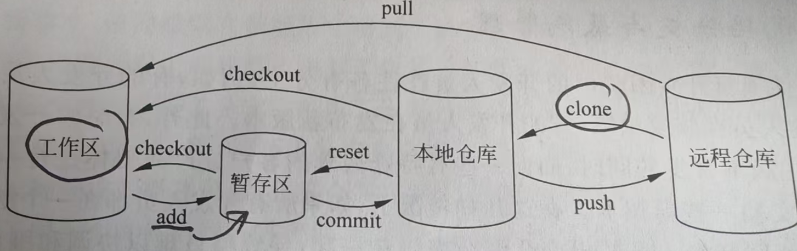
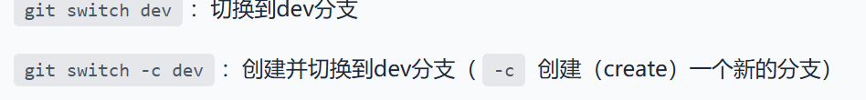
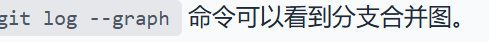

**集中式版本控制系统**->集中式架构 客户端没有完整版本历史 只能联网提交 以目录方式管理分支

**分布式版本控制系统**->分布式架构 客户端保存完整版本提交历史 可以离线提交 强大的分支管理能力

掌握 Git 是现代开发的必修课。你可以把 Git 想象成一个**代码时光机**，它能记录你代码的每一个瞬间，并允许你随时穿梭回过去。

## git常用命令
---
### 1. 初始化与配置

在开始写代码前，你需要告诉 Git 你是谁，并建立你的本地仓库。

* **`git init`**: 在当前目录下初始化一个新的 Git 仓库。
* **`git clone [url]`**: 从远程服务器克隆一个现有的项目。
* **`git config --global user.name "你的名字"`**: 设置提交代码时的用户名。
* **`git config --global user.email "你的邮箱"`**: 设置提交代码时的邮箱。

---

### 2. 核心工作流（最常用）

这是你每天在电脑前重复次数最多的步骤：**修改 -> 暂存 -> 提交**。

* **`git status`**: 查看当前状态。哪些文件改了？哪些还没提交？（**新手的救命稻草**，不确定时就输入它）。
* **`git add [file]`**: 将文件更改添加到**暂存区 (Staging Area)**。
* `git add .` : 暂存当前目录下所有的更改。
* **`git commit -m "提交信息"`**: 将暂存区的文件正式保存到本地仓库。
* **`git diff`**: 查看具体改动了哪些代码行。

---
### 3. 分支管理

| 分支名后缀 | 用途 |
|---|---|
| main / master |生产环境代码。永远保持稳定，随时可以发布|。
|develop|开发主分支。所有新功能最终都会汇聚到这里测试。|
|feature/xxx|新功能分支。写完功能后合并回 develop 然后删除|
|hotfix/xxx|紧急修复分支 专门用于修线上紧急 Bug|
|release/xxx|发布预备分支。发布前的最后测试和版本号调整。|

分支让你可以在不影响主线代码（通常是 `main` 或 `master`）的情况下尝试新功能。
* **`git branch`**: 列出所有本地分支。
* **`git checkout -b [branch-name]`**: 创建并切换到一个新分支。
* **`git checkout [branch-name]`**: 切换到已有的分支。
* **`git merge [branch-name]`**: 将指定分支的代码合并到当前分支。
* **`git branch -d [branch-name]`**: 删除不再需要的分支。

#### bug分支

`git stash-->隐藏当前工作 恢复后继续执行`
`git stash pop，回到工作现场；`
`master分支上修复的bug，想要合并到当前dev分支，可以用git ``cherry-pick <commit>命令，把bug提交的修改“复制”到当前分支，避免重复劳动。`
---
### 4. 远程操作

当你需要和团队协作，或者把代码备份到 GitHub/GitLab 时，会用到这些。
* **`git pull`**: 拉取远程仓库的最新代码并直接合并到本地。
* **`git fetch`**: 获取远程更新，但不自动合并（比 pull 更安全）。
* **`git push origin [branch-name]`**: 将本地分支的提交推送到远程仓库。
* **`git remote -v`**: 查看当前关联的远程仓库地址。
---
### 5. 撤销
* **`git checkout -- [file]`**: 撤销工作区中某个文件的修改（回到上次提交的状态）。
* **`git reset HEAD [file]`**: 把已经 `add` 的文件从暂存区撤回。
* **`git log`**: 查看提交历史，找回以前的提交 ID。
* **`git reset --hard [commit-id]`**: 彻底回退到某个历史版本（**慎用**，会抹掉未提交的改动）。
---
